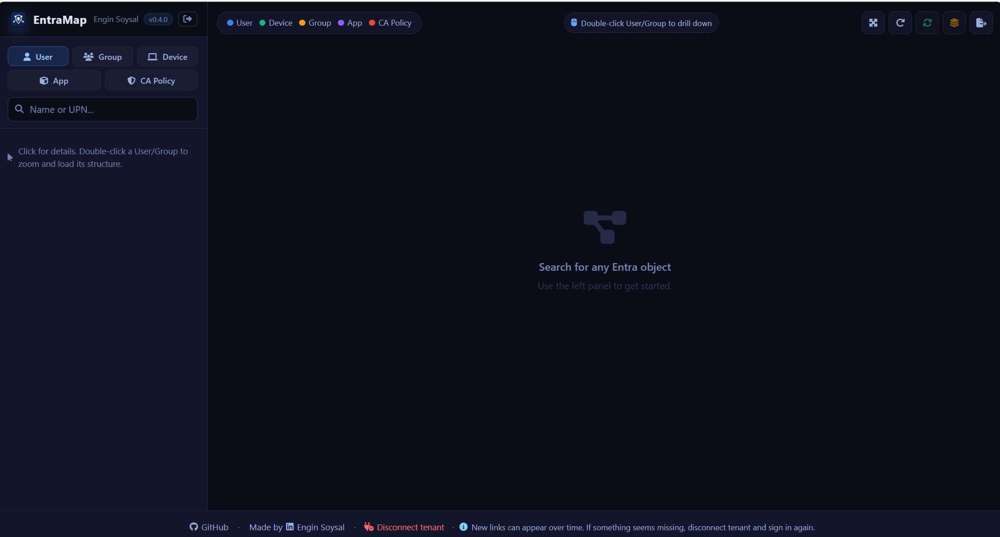
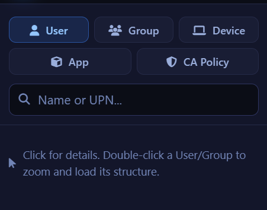
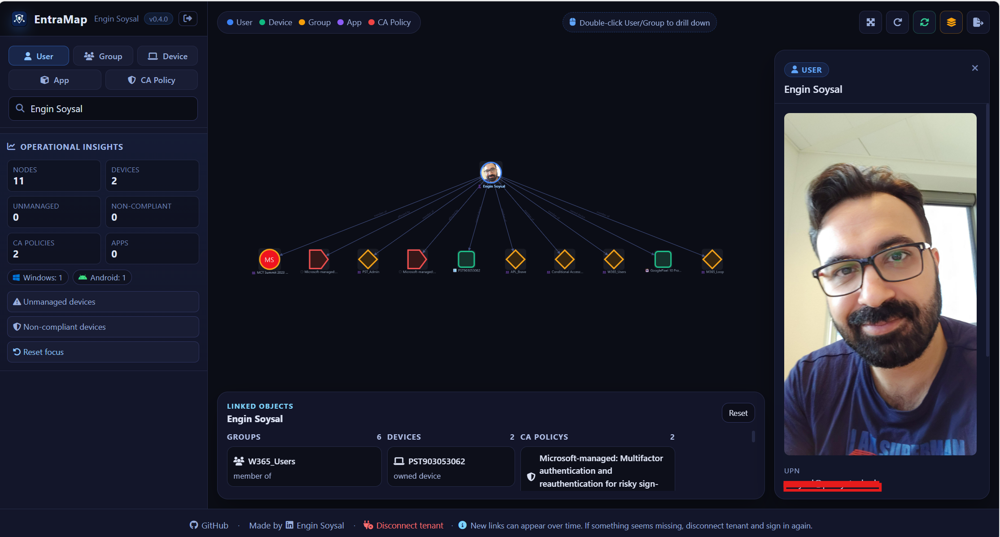
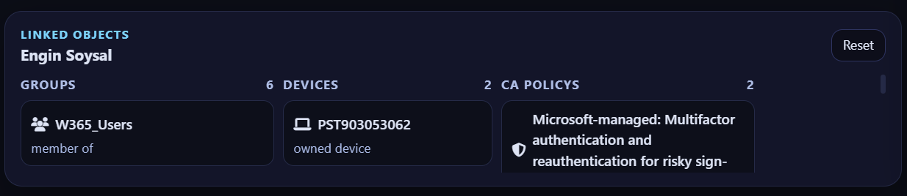
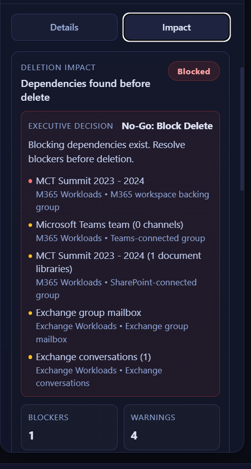
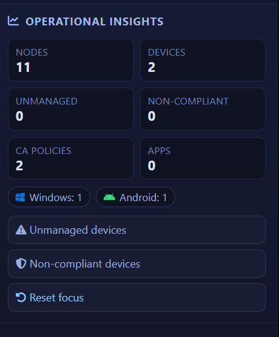

# EntraMap

[](LICENSE)

Version 0.4.1

EntraMap is a Flask web application that signs users in with Microsoft Entra ID and visualizes tenant relationships as an interactive graph. It helps you explore users, devices, groups, applications, and Conditional Access policies from a single screen.

## Features

- Multi-tenant Microsoft sign-in with delegated Microsoft Graph permissions
- Homepage-first login popup flow with contextual onboarding tabs and in-app release transparency
- Search for users, groups, devices, Intune apps, and Conditional Access policies
- Group deletion impact analysis across CA, Intune, IAM/PIM, Administrative Units, group nesting, licensing, Entitlement Management, M365 workloads, and Exchange workload signals
- Coverage transparency with completeness score, constrained-domain reasons, and scan-limit metadata
- Executive go/no-go delete guidance with top evidence, remediation guidance, owner suggestions, and per-group checklist tracking
- Saved checklist progress per group with reset and open-actions filtering
- Interactive graph view powered by Cytoscape.js
- Relationship mapping for:
  - Users to devices
  - Users to groups
  - Groups to enterprise applications
  - Users and groups to Conditional Access policies
- Clickable nodes with detail panels
- Graph node photo rendering for users and groups
- Double-click drill-down navigation on all supported object types
- Operational insights panel with quick risk filters
- JSON export of the current graph for reporting and handover
- CSV export of group impact analysis for governance and CAB workflows
- Read-only deep links to Entra portal object pages
- Frontend onboarding tabs embedded in the authentication popup (Sign In, Features, How To Use, API Permissions, Changelog)
- In-app changelog rendered directly from `LOG.md`
- Idle session timeout warning with 60-second countdown before auto sign-out

## Latest Changes (0.4.1)

- Added policy-to-group mapping improvements for Conditional Access with explicit included and excluded group scope visibility in the graph
- Added dynamic group support across mapping and search, including membership rule and rule-processing state details in the UI
- Added CA scope edge coloring and contextual scope legend behavior so include/exclude targeting is easier to interpret
- Added a Konami easter egg flow: signed-out users see a lightweight "Nope... you're not logged in." character prompt; signed-in users can launch an in-panel mini Asteroids mode
- Expanded the mini Asteroids mode with boss encounter, enrage phase visuals, and balance tuning for a softer difficulty curve
- Continued documentation and release consistency updates across README, FILES, and LOG

## 0.4.1 Focus

Version 0.4.1 focuses on two themes: clearer policy targeting visibility for real operational mapping, and a playful but controlled in-app easter egg experience that stays isolated from the core tenant workflow.

Operational highlights in 0.4.1:

- clearer policy scoping (included vs excluded groups)
- deeper dynamic group context (rule + processing state)
- stronger graph readability through scope-specific edge styling and legend cues
- optional mini-game easter egg that never takes over the full page

## Screenshots

### Main Screen



### Search Objects



### User Search



### Linked Objects



### Impact Screen



### Operational Insights



## Release History

For full historical version notes, see `LOG.md`.

## License

This project is licensed under the MIT License. See the `LICENSE` file for details.

## Requirements

- Python 3.11+ recommended
- A Microsoft Entra app registration configured as multi-tenant
- A client secret for the app registration
- Microsoft Graph delegated permissions with tenant consent

## Microsoft Entra App Registration

Create an app registration in Azure with these settings:

- Name: EntraMap
- Supported account types: Accounts in any organizational directory (Multitenant)
- Redirect URIs:
  - http://localhost:5000/auth/callback
  - https://YOUR-PRODUCTION-DOMAIN/auth/callback

### Delegated Microsoft Graph Permissions

Add these delegated permissions:

- User.Read
- User.ReadBasic.All
- Group.Read.All
- Device.Read.All
- DeviceManagementApps.Read.All
- Application.Read.All
- Policy.Read.All
- RoleManagement.Read.Directory
- Organization.Read.All
- EntitlementManagement.Read.All
- Team.ReadBasic.All
- Sites.Read.All
- Tasks.Read
- Directory.Read.All

Optional (recommended if you want full Group Impact coverage without partial domains):

- AdministrativeUnit.Read.All

Notes:

- RoleManagement.Read.Directory is used for IAM and PIM impact checks.
- Organization.Read.All improves group-based licensing resolution.
- EntitlementManagement.Read.All enables Entitlement Management policy coverage.
- Team.ReadBasic.All improves Teams workload signal coverage.
- Sites.Read.All improves SharePoint workload signal coverage.
- Tasks.Read improves Planner workload signal coverage.
- AdministrativeUnit.Read.All is used for Administrative Unit impact checks.
- Even with correct Graph permissions, some results can still be partial when the signed-in account lacks sufficient Entra role visibility.

### Consent Model

The first sign-in for a tenant must be completed by a role capable of granting tenant-wide consent, typically:

- Global Administrator
- Privileged Role Administrator

After tenant-wide consent is granted once, regular users in that tenant can sign in without extra Azure setup.

## Local Setup

1. Install dependencies:

```powershell
pip install -r requirements.txt
```

2. Copy the environment template:

```powershell
Copy-Item .env.example .env
```

3. Fill in these values in .env:

- CLIENT_ID
- CLIENT_SECRET
- FLASK_SECRET_KEY
- APPLICATIONINSIGHTS_CONNECTION_STRING or APPINSIGHTS_INSTRUMENTATIONKEY (optional)

4. Start the app:

```powershell
python app.py
```

5. Open:

```text
http://localhost:5000
```

## Azure Deployment Notes

This project is ready to be hosted on Azure App Service.

Recommended app settings:

- CLIENT_ID
- CLIENT_SECRET
- FLASK_SECRET_KEY
- APPLICATIONINSIGHTS_CONNECTION_STRING (preferred) or APPINSIGHTS_INSTRUMENTATIONKEY

Recommended startup command:

```text
gunicorn --bind=0.0.0.0 --timeout 600 app:app
```

If you deploy on Windows App Service and prefer the built-in Python startup behavior, make sure the app starts app.py correctly and the environment variables are configured in App Settings.

### Application Insights

This app can send request, exception, dependency, and optional application logging telemetry to Azure Monitor Application Insights.

Recommended configuration:

- Set `APPLICATIONINSIGHTS_CONNECTION_STRING` to the connection string from your Application Insights resource.
- If you only have an instrumentation key, set `APPINSIGHTS_INSTRUMENTATIONKEY`; the app uses a compatible instrumentation-key exporter path for Flask telemetry.
- Keep `APPLICATIONINSIGHTS_ENABLE_LOGGING=true` if you also want Python log events in Application Insights.

Notes:

- Connection strings are the modern Azure Monitor configuration model; prefer them over instrumentation keys for new deployments.
- Instrumentation-key support is kept as a compatibility path because many existing Application Insights resources still expose that value during migration.
- After deployment, hit `/api/health` or load the homepage once and then verify incoming requests in the Application Insights resource.

## Security Notes

- Never commit .env to source control
- Rotate client secrets regularly
- Use a strong FLASK_SECRET_KEY in production
- Review delegated permissions carefully before production rollout

### Production Hardening

For production usage, configure these additional safeguards:

- Set `SESSION_COOKIE_SECURE=true` when running behind HTTPS
- Keep session lifetime short with `SESSION_TTL_MINUTES` (for example 30-60)
- Prefer Redis-backed sessions over local filesystem (`SESSION_TYPE=redis`, `REDIS_URL`)
- Enable token cache encryption at rest with `TOKEN_CACHE_ENCRYPTION_KEY`
- Restrict operational access to host filesystem and deployment tooling (least privilege)

## Contributing

Contributions are welcome.

1. Fork the repository and create a feature branch.
2. Keep changes focused and include clear commit messages.
3. Run the app locally and validate the affected flow before opening a PR.
4. Open a pull request with context, test notes, and screenshots when UI is impacted.

## Project Structure

See FILES.md for a file-by-file breakdown.
See LOG.md for the release history.
